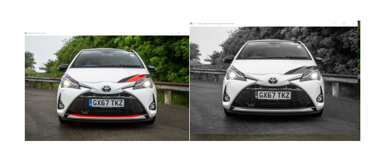
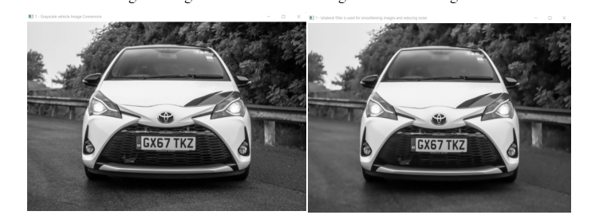
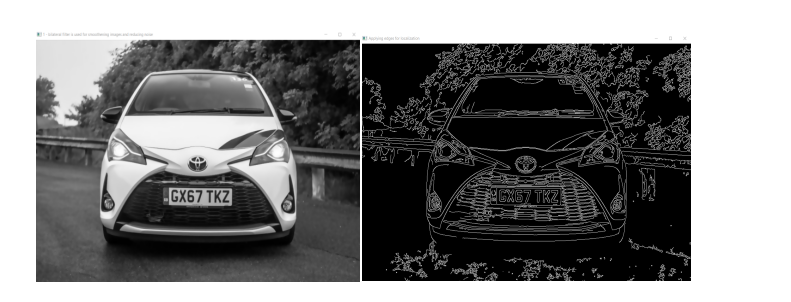
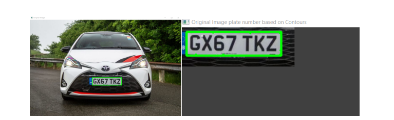
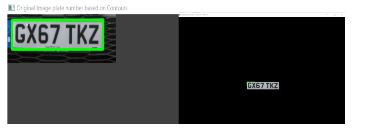
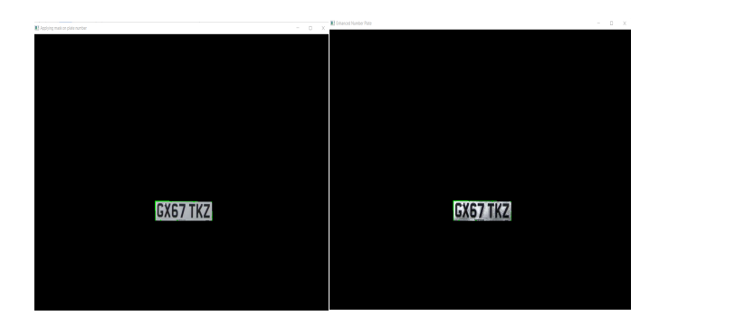
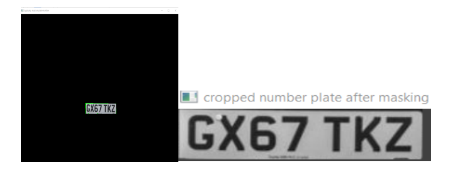
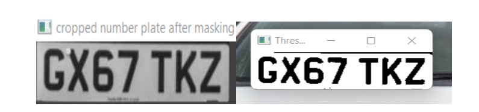
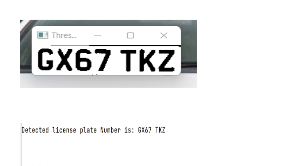

# License Plate Recognition For Vehicles
_An Automatic License Plate Recognition System

This system can detect and recognize 2 types of license plate , rectangle plates and partially square plates.

## **About**
A Python programme that uses concepts of image processing and OCR to identify the characters on a given vehicle licence plate. The OCR aspect was done with machine learning to differentiate and recognise the licence plate amongst multiple colour spaces within images.

## **Goal**
 
The goal is to be able to differentiate the noise from the licence plate for any given image and to detect the licence plate for any given image of the same camera for any vehicle, and segment the characters to be ready for recognition.

## **Functionality**
1. A GUI interface that makes image selection easier using ImageTk
2. Performs all the stages of Automatic License plate recognition (ALPR); plate localization, character segmentation and character recognition
3. You can generate your model that will be used by the ALPR
4. You can use your own training data
5. Easy visualization for debugging purposes

## Method
1. Plate detection
   - Image Processing Techniques for transformation followed my morphological preprocessing
   - Finding contours which satisfy the ratio of the plate to get the possible plates
   - Checking for characters on the possible plates found to assure it is a license plate.
2. Plate recognition
   - For character recognition, I used Tesseract as it was lightweight and suitable for real-time recognition.

## **Dependencies**
The program was written with Python 3.9.13 and the following python packages are required

* import tkinter as tk
* from tkinter import *
* from tkinter.filedialog import askopenfilename
* import cv2
* import imutils
* import numpy as np
* import pytesseract
* from PIL import Image, ImageTk
* from imutils.contours import sort_contours

## **Implementation**
1. Clone the repository or download the zip `git clone https://github.com/leenock/-license-plate-detect.git`
2. install location of Tesseract-OCR in your system -- specify the directory after installing tesseract on the program code
3. run test_image.py for testing on an image.

## **Result**
#### Image to Gray Image Conversion.

#### Noise Removal through bilateral filtering

#### Edge detection method

#### Extracting contours bonding box for ROI from the Image

#### Applying mask

#### histogram Equalization

#### cropping the image after mask preprocessing

#### Threshold using Otsu's

#### converting the image cropped to text using pytesseract

## Note

- Change image noise reduction methods, contours parameters to get different results or improve the current developed more. 